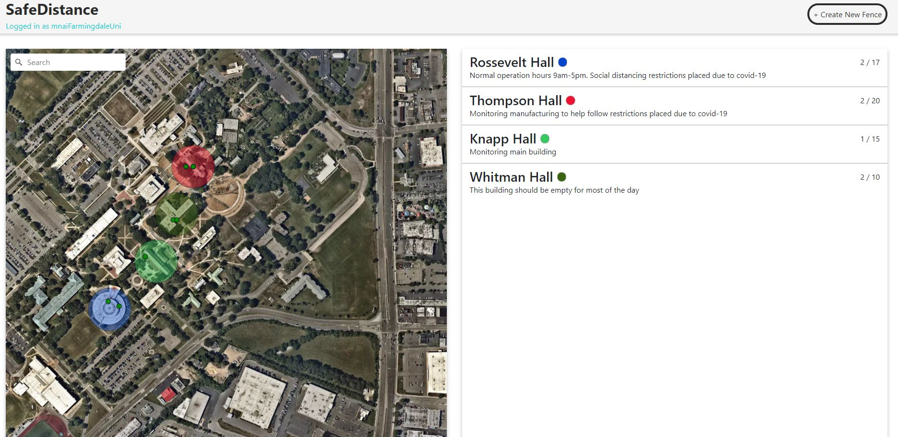
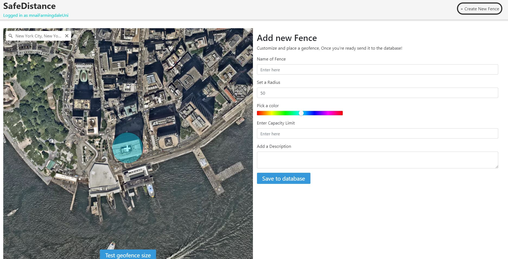
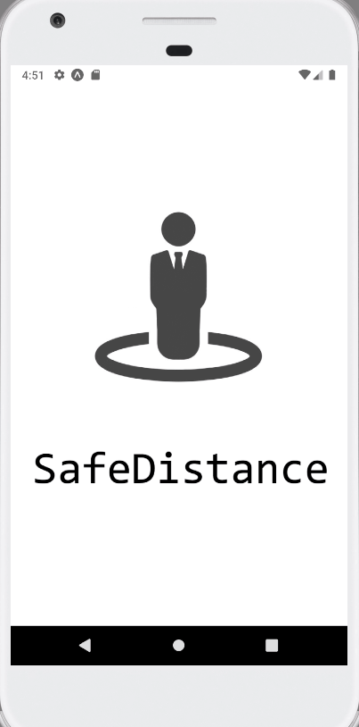
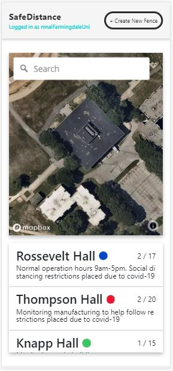
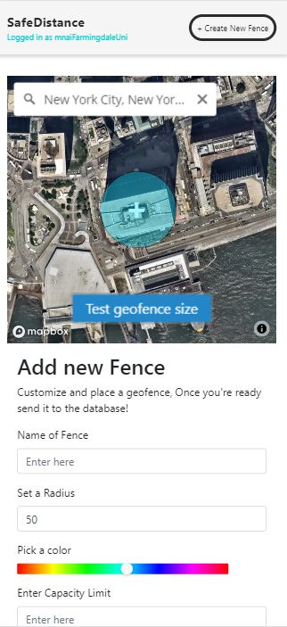

# Safe Distance Documentation

Project for the Human Resources Hackathon 2020
[Video Presentation](https://www.youtube.com/watch?v=5AGJhjKrZgM)

## About

- Julian Hecker, frontend and design
- Ian Matlak, react: mobile and web
- Joshua Obogbaimhe: backend API, database

## Web Application (Currently looking at)

Built with React

- Login page
  - Login or register to access the web application
- Home page requests data on fences and user locations from database and displays them on a map
  - Map made with DeckGL and Mapbox
  - App periodically requests new user location data
- New Fence page provides an interface to submit a new geofence to the server
  - Map displays fence before submitting
  - Form has fields for `name`, `description`, `radius`, `capacity`, and `color (rgb)`.

## [Mobile Application](https://github.com/mnai01/HackHR-Mobile)

Built with React Native and Expo.

- When "start tracking" button is pressed, device will periodically send location data to the server via REST API

## [Raspi Backend](https://github.com/mnai01/HackHR-RasPi-Backend)

Analyzes the number of wifi-enabled devices within a certain radius of the raspberry pi microcomputer.
[View working prototype repo](https://github.com/mnai01/HackHR-RasPi-Backend)

## Backend API

The backend consists of NodeJS, Express, and PostgreSQL.

- Node/Express provides routes for API to access saved data.
- PostgreSQL database stores data on user positions and fences.
- Routes:
  - `GET /api/users/` Get all user positions
  - `GET /api/fences/` Get all geofences
  - `POST /api/users/` Update user location
  - `POST /api/users/fence` Add new geofence
